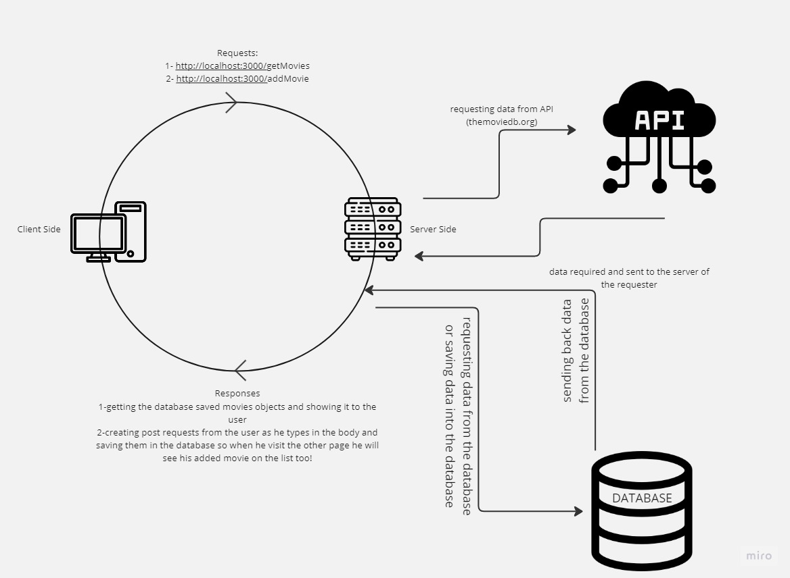

# Movies Library - Version 1.0

**Author Name**: Hasan Tummalei

## WRRC

## Overview

This is the first version of my first server using node and express.

## Getting Started

1. Install the latest version of stable Nodejs.
2. Make a directory  for the project.
3. Create server.js file as a starting point for the application.
4. Initiate package.json file using  `npm init -y` 
5. Installing express and cors packages using `npm i express cors`
6. Then use express and cors packages to build up your server by declaring a variable for each, containing the required framework and library.
7. Created a constructor function to regenerate the info we are importing (requiring the db.json) into a template of our choice to deal with.
8. We used a databased so you should have your own db.json you will reply on to make your project work.
9. Start dealing with requests mainly in this project we used `get` http request to recieve requests and send responses using the built in parameters passed into our call back function eg. `req,res` and we declared a path (routes) so our function will execute once that path been called by the user, once it's called a response will got back using `res.send` as an example.
10. Then we created Error handlers using different methods for each.

## Project Features

- Recieving requests from users based on the url path they are visiting and rendering information from our data base as a response using expressJs framework.
- Handling errors if happened during the user experience using the website.
- The project was built with NodeJs on local machine as a first version object.
- data are returned in json format to deal with clients.

## Movies Library - Version 1.1

## WRRC

## Added steps

1. Install nodemon using this command `npm install -g nodemon`  so you can see updated on your server without shutting down and restarting the server.
2. Install two packages, one dealing with the API called `axios` and the other with a file added to our project called `.env` will deal with enviromental variables called `dotenv` using this command `npm install dotenv axios`.
3. start the server typing nodemon.
4. Then start adding functionalities from your API using the API source link and the data path you are requesting, after generating the API key of yours, then used methods of Async to avoide and handle promises `async` and `await`, or `.then` all of that after requiring (`dotenv.config()`) and once you type axios, it will require the package automatically using VSCode.

## Added Features

- the data is imported from an online source <https://developer.themoviedb.org/>
- added new 4 paths the user can surf, Trending/Search/Upcoming/Top-Rated
- The search path allows the user to search his movies for a result by passing a query value in the URL.

## Movies Library - Version 1.2

## WRRC 

## Added steps

1. Start your server installed from postgres packages using `sqlstart`.
2. Connecting to your database using `psql`
3. After that you install a package to connect your server and your database , just type in the terminal `npm install pg`
4. then you have to require the package you just installed to use it on yourserver, getting data from the database require you to use two methods `(sql,query)` after creating a `client` to connect to your database link using `new pg.Client()` line 
5. After creating a connection point you have to listen and connect to it once the server starts so wrap your app lister with `client.connect` method and don't forge about the promises.
6. then you can start creating tables in your database manually or getting them done by a user then save them using`insert` methods from postgres then post requests, and require them or getting them using `select` method from postgres get request to show them for a user.
7. don't forget to protect your database from `SQL Injecting`.

## Movies Library - Version 1.3

## WRRC 

## Added steps

1. Used put/patch and Delete requests to manipulate data in our databases, creating new endpoints linked to executable functions once the user request these endpoints

## Added Features

- Delete a movie from database using it's ID.
- Updating the data about the movie using it's ID as reference.
- selecting a certain movie to get it's data using it's ID as a refernece.
